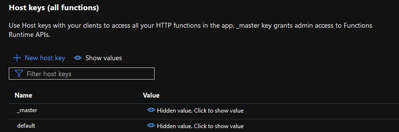
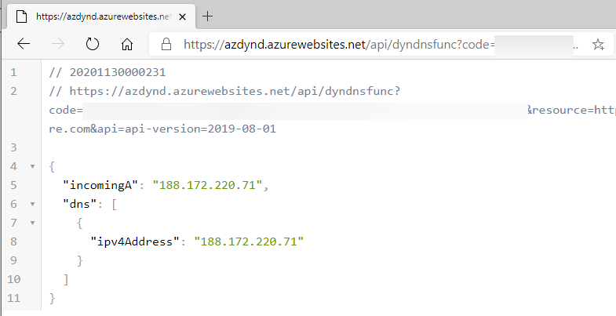
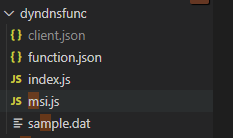
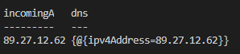

# Dyndns for a dime 0.1
- Create dyndns endpoint which updates Azure DNS based on the callers Public IP address which is seen on the function side
    - Typical use case would be a having raspberry PI curl the endpoint as scheduled task 
- The caller is authorized by the function key 

- Almost all basic HTTP clients and browsers should work


# Other
- This guide is not comprehensive and code was created for minimum viable testing (configs missing etc) 
    - it highlights the critical parts of the deployment, but  leaves open the deployment methods, and setting up the runtime environment
    - Easiest way (likely) is to deploy the code VScode
- This is not the first time dyndns has been done on Azure. Looking for something stable you might to go elsewhere :)... 
- The code does barely any error handling. If something is wrong it will timeout, or throw some of the errors in a promise rejection

# requirements
- Functions runtime on extensions, and functions runtime including NodeJS installed on the desktop you are planning to deploy from 
- SPN for local testing
- Azure Function (Consumption, Windows App Service)
- NodeJS runtime 12
-   Enable the function for managed identity
- DNS zone in Azure
    - add the SPN and MSI as DNS contributor to the single record (not the whole zone) which you want to be the updated record
    - update index.js to match the DNS resource 
    ```javascript
    var uri = "https://management.azure.com/subscriptions/mySUBID/resourceGroups/myRG/providers/Microsoft.Network/dnszones/dewi.red/A/dyn?api-version=2018-05-01"
    ```


# local testing 
create client.json file in the function folder


```json
{
    "grant_type":"client_credentials",
    "client_id":"4d102cc5-d0ff-420a-b34f-e8503280f3c1",
    "client_secret":"mysecret",
    "resource":"https://management.azure.com"
}
```
run func host start --javascript

call function locally 
```
Invoke-RestMethod  http://localhost:7071/api/dyndnsfunc -Headers @{'x-forwarded-for'="1.2.2.4:54466"}
```

# Expected results
if all checks out: 
- the SPN and MSI is given permission for the DNS zone, and correct app service plan (windows in this case, as I had trouble with Linux App Service and MSI this )
This is what you should see on updates
```powershell
# Azure DNS zone and the NS record here
nslookup dyn.dewi.red ns1-07.azure-dns.com
$apiver = "api-version=2019-08-01"
$resource = "https://management.azure.com"
$code = "myfunctioncode"
$uri ="https://azdynd.azurewebsites.net/api/dyndnsfunc?code=$code&resource=$resource&api=$apiver";
$sd = Invoke-RestMethod -UseBasicParsing $uri
$sd
start-sleep -Seconds 2
nslookup dyn.dewi.red ns1-07.azure-dns.com
$sd
```
Upon complete deployment you should see following update on response, and the NSLookup reflect the record 
```nslookup dyn.dewi.red ns1-07.azure-dns.com```

