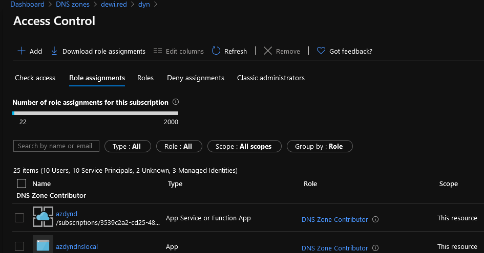

# Dyndns for a dime 
- Create dyndns endpoint which updates Azure DNS based on the callers Public IP address which is seen on the function side
    - Typical use case would be a having raspberry PI curl the endpoint as scheduled task 
- The caller is authorized by the function key 

- Almost all basic HTTP clients and browsers should work


# Other
- This guide is not comprehensive, it highlights the critical parts of the deployment, but  leaves open the deployment methods, and setting up the runtime environment
    - Easiest way (likely) is to deploy the code VScode
- The code does barely any error handling. If something is wrong it timeout, or throw some of the non errors in a promise rejection

# requirements
- Functions runtime on extensions, and functions runtime including NodeJS installed on the desktop you are planning 
- SPN for local testing
- Azure Function (Consumption, Windows App Service)
- NodeJS runtime 12
-   Enable the function for managed identity
- DNS zone in Azure
    - add the SPN and MSI as DNS contributor to the single record (not the whole zone) which you want to be the updated record
    - update index.js to match the DNS resource 
    ```javascript
    var uri = "https://management.azure.com/subscriptions/3539c2a2-cd25-48c6-b295-14e59334ef1c/resourceGroups/dewired-rg/providers/Microsoft.Network/dnszones/dewi.red/A/dyn?api-version=2018-05-01"
    ```



# local testing 
create client.json file in the function folder


```json
{
    "grant_type":"client_credentials",
    "client_id":"4d102cc5-d0ff-420a-b34f-e8503280f3c1",
    "client_secret":"mysecret",
    "resource":"https://management.azure.com"
}
```
run func host start --javascript